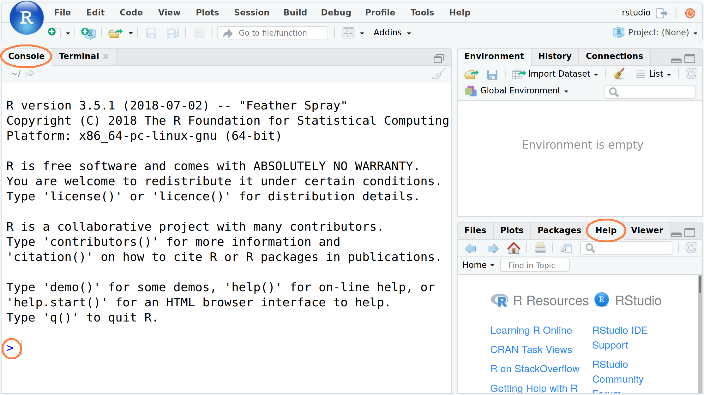

```{r setup, include=FALSE}
knitr::opts_chunk$set(echo = TRUE, eval = TRUE) #, knitr.table.format = 'latex')
# library(knitr)
library(tidyverse)
library(knitr)
library(kableExtra)
options(width=45)
knitr::opts_chunk$set(fig.pos = 'H')

# Making some aesthetic changes for this document
theme_set(theme_gray(base_size = 9))
update_geom_defaults("point", list(size = 0.5))
update_geom_defaults("boxplot", list(outlier.size = 0.5))
```

# Preface

This "Getting Started" guide will give you a flavour of what R[^baseR] and the 
tidyverse can do for you. To get the most out of this guide, read it whilst 
doing the examples and exercises using RStudio[^rstudio]^. 

## Experiment Safely

Be brave and experiment with commands and options as it is an essential part of the 
learning process. Things can (and will) go "wrong", like, getting error messages or 
deleting things that you created from using this guide. You can recover from most 
situations (e.g. by restarting R). To do this "safely" start with a *fresh* R session
without any other data loaded (otherwise you could lose it). 

# Introduction

## Before Starting

Make sure that you have:

1. R and RStudio installed
2. Files downloaded from: [https://ilustat.com/resources/](https://ilustat.com/resources/) **[UPDATE]**
3. Double click on the file `"GettingStartedinR.Rproj"` which will open RStudio automatically 
with the right set up to work through this guide.

## Starting R & RStudio

R starts automatically when you open RStudio (see Figure \ref{fig:rstudio}). The console 
starts with information about the version number, license and contributors. 
The last line is a standard prompt "`>`" that indicates R is ready and expecting
instructions to do something.

```{r RStudioScreenshot, out.width="3.4in", fig.show='hold', fig.cap="\\label{fig:rstudio}RStudio Screenshot with Console on the left and  Help tab in the bottom right", echo=FALSE}

```

## Quitting R & RStudio

When you quit RStudio you will be asked whether to `Save workspace` with two options:

* "Yes" -- Your current R workspace (containing the work that you have done) will be 
restored next time you open RStudio.
* "No" -- You will start with a fresh R session next time you open RStudio. For now 
select "*No*" to prevent errors being carried over from previous sessions).

# R Help

I strongly recommend that you learn how to use R's useful and extensive built-in help 
system as it is an essential part of finding solutions to your R programming problems. 
The easiest way is to use RStudio's "Help" tab which has a search box (see Figure 
\ref{fig:rstudio}). 

## `help()` function

From the R "Console" you can use the `help()` function or `?`. For example, try the following two 
commands (which give the same result):
```{r helpttest, echo=TRUE, eval=FALSE}
help(mean)
?mean
```

## Keyword search

To do a keyword search use the function `apropos()` with the keyword in double quotes 
(`"keyword"`) or single quote (`'keyword'`). For example:
```{r aproposShow, echo=TRUE, eval=TRUE}
apropos("mean")
```

## Help Examples

Use the `example()` function to run the examples at the end of the help for a function:
```{r egttest}
example(mean)
```

## Searching On-line For R Help

There are a lot of on-line resources that can help. However you must understand that 
blindly copying and pasting could be harmful and further it won't help you to learn and
develop. When you search on-line use `[R]` in your search term (e.g. "`[R] summary 
statistics by group`"). Note that often there is more than one solution to your problem. 
It is good to investigate the different options.

## Exercise

Try the following:

* `help(median)`
* `?sd` 
* `help(unique)`

# Some R Concepts

In R speak, scalars, vectors/variables and datasets are called ***objects***. To create
objects (things) we have to use the assignment operator "`<-`". For example, below, object 
`height` is assigned a value of 173 (type `height` shows its value):
```{r createObjs}
height <- 173
height
```

## Warning: R is case sensitive

`age` and `AGE` are different:
```{r caseSens1}
age <- 10
AGE <- 50
```

```{r caseSens2}
age
AGE
```

## New lines

R commands are usually separated by a new line but they can also be separated by a 
semicolon "`;`". 
```{r semicolon}
Name <- "Leo"; Age <- 25; City <- "Lisbon"
Name; Age; City
```

## Comments

It is useful to put human readable comments in your programs. These comments could 
help the future you when you go back to your program. R comments start with a hash 
sign (`#`). Everything after the hash to the end of the line will be ignored by R.
```{r comments}
# This comment line will be ignored when run.
AGE       # Text after "#" is ignored.
```

## Warning

If an R command is not complete then R will show a plus sign ("`+`") prompt
on second and subsequent lines until the command syntax is correct.
```{r continuation, echo=TRUE, eval=FALSE}
+
```
To break out this, press the escape key (`ESC`).

## Recalling previous commands

To recall a previously typed commands use the up arrow key ($\uparrow$).
To go between previously typed commands use the up and down arrow
($\downarrow$) keys. Once a command is recalled, it can be modified/corrected
using the left ($\leftarrow$) and right arrow ($\rightarrow$) keys.

# R as a Calculator

You can use R as a calculator. Try the following:
```{r calcBasic}
2 + 3           
(5*11)/4 - 7     
# ^ = "to the power of"
7^3 
```

## Other math functions

You can also use standard mathematical functions that are typically found on a scientific
calculator.

* Trigonometric: `sin()`, `cos()`, `tan()`, `acos()`, `asin()`, `atan()` 
* Rounding: `abs()`, `ceiling()`, `floor()`, `round()`, `sign()`, `signif()`, `sqrt()`, 
`trunc()`
* Logarithms & Exponentials: `exp()`, `log()`, `log10()`, `log2()`
 
```{r calcFunctions}
# Square root
sqrt(2)          
# Round down to nearest integer
floor(8.6178)
# Round up to nearest integer
ceiling(8.6178)
# Round to 2 decimal places
round(8.6178, 2)
```

## Exercise
Try out five of the mathemtical functions above, using the help page where necessary. 

# Some More R Concepts

You can do some clever and useful things with using the assignment operator  "`<-`": 
```{r assignBasic}
roomLength <- 7.8
roomWidth <- 6.4
roomArea <- roomLength * roomWidth
roomArea
```

## Text objects

You can also assign text to an objects.
```{r assignText}
Greeting <- "Hello World!"
Greeting
```

## Vectors

The objects presented so far have all been scalars (single values). Working with vectors 
is where R shines best as they are the basic building blocks of datasets. To create a 
vector we can use the `c()` (combine values into a vector) function.
```{r cVector}
# A "numeric" vector
x1 <- c(26, 10, 4, 7, 41, 19)
x1
# A "character" vector of country names
x2 <- c("Peru", "Italy", "Cuba", "Ghana")  
x2
```

There are many other ways to create vectors, for example, `rep()` (replicate elements)
and `seq()` (create sequences):
```{r repseq}
# Repeat vector (2, 6, 7, 4) three times
r1 <- rep(c(2, 6, 7, 4), times=3)
r1
# Vector from -2 to 3 incremented by half
s1 <- seq(from=-2, to=3, by=0.5)
s1
```

## Vector operations

You can do also calculations on vectors, for example using `x1` from above:
```{r operationsVecs}
x1 * 2
round(sqrt(x1*2.6), 2)
```

## Missing Values

Missing values are coded as `NA` in R. For example,
```{r}
x2 <- c(3, -7, NA, 5, 1, 1) 
x2
x3 <- c("Rat", NA, "Mouse", "Hamster")
x3
```

## Managing Objects

Use function `ls()` to list the objects in your workspace. The `rm()` function removes
(delete) them.
```{r lsrm}
ls()
rm(x, x1, x2, x3, xm, r1, s1, AGE, age)
ls()
```


# R Functions and Packages

## R Functions

We have already used some R functions (e.g.  `c()`, `mean()`, `rep()`, `sqrt()`, `round()`).
Most of the computations in R involves using functions. A function essentially has
a name and a list of arguments separated by a comma. Let's have look at an example:
```{r functionUsage}
seq(from = 5, to = 8, by = 0.4)
```
The function name is `seq` and it has three arguments `from`, `to` and `by`. The arguments
`from` and `to` are the start and end values of a sequence that you want to create, 
and `by` is the increment of the sequence. The `seq()` functions has other arguments that 
you could use which are documented in the help page. For example, we could use the argument
`length.out` (instead of `by`) to fix the length of the sequence as follows:
```{r functionAlt}
seq(from = 5, to = 8, length.out = 16)
```

## Custom Functions

You can create your own functions (using the `function()` function) which is a 
very powerful way to extend R. Writing your own functions is outside the scope 
of this guide. As you get more and more familiar with R it is very likely that you 
will need to learn do so but for now you don't need to.

## R Packages

You can do many things with a standard R installation and it can be extended using 
contributed packages. Packages are like apps for R. They can contain functions, data 
and documentation.

## `tidyverse`

The `tidyverse` package[^tidyverse] is a collection of packages the lets you import, 
manipulate, explore, visualise and model data in a harmonised and consistent way which 
helps you to be more productive. We will use the `tidyverse` to visualise and summarise 
data. 


## To continue please install the `tidyverse` package
```{r installTidyverse, echo=TRUE, eval=FALSE}
install.packages("tidyverse")
```

## Loading packages

To use the `tidyverse` package load it using the `library()` function:
```{r usePackage}
library(tidyverse)
```

# Chick Weight Data

R comes with many datasets installed[^Rdatasets]. We will use the `ChickWeight` dataset 
to learn about the tidyverse. The help system gives a basic summary of the experiment from 
which the data was collect:

> *"The body weights of the chicks were measured at birth and every second day thereafter 
until day 20. They were also measured on day 21. There were four groups of chicks on 
different protein diets."*

You can get more information, including references by typing:
```{r helpCWdata, echo=TRUE, eval=FALSE}
help("ChickWeight")
```

## The Data

There are `r nrow(ChickWeight)` observations (rows) and `r ncol(ChickWeight)` variables:

* `Chick` -- unique ID for each chick. 
* `Diet` -- one of four protein diets. 
* `Time` --  number of days since birth. 
* `weight` -- body weight of chick in grams.

## Note 

`weight` has a lower case `w` (recall R is case sensitive).

## Objective

Investigate the *effect of diet on the weight over time*.

# Importing The Data

```{r writeCW, echo=FALSE}
ChickWeight %>%
  select(Chick, Diet, Time, weight) %>% 
  arrange(Chick, Diet, Time) %>% 
  write_csv("ChickWeight.csv")
```

First we will import the data from a file called `ChickWeight.csv` using the `read_csv()` 
function from the `readr` package (part of the `tidyverse`). The first thing to do, 
outside of R, is to open the file `ChickWeight.csv` to check what it contains and that 
it makes sense. Now we can import the data as follows:
```{r readCW}
CW <- read_csv("ChickWeight.csv")
```
All columns (variables) have been read in as numeric values (i.e. `col_double()`) but
you may see that they are read in a integer (i.e. `col_int()`) due to operating system
differences.

## Important Note

If all goes well then the data is now stored in an R object called `CW`. If you get the
following error message then you need to change the working directory to where the data is
stored.
```
Error: 'ChickWeight.csv' does not exist in current
working directory ...
```
## Change the working directory in RStudio

From the menu bar select "Session - Set Working Directory - Choose Directory..." then 
go to the directory where the data is stored. Alternatively, within in R, you could use 
the function `setwd()`[^setwd].

# Looking at the Dataset

To look at the data type just type the object (dataset) name: 
```{r printCW}
CW
```

## `glimpse()` function

If there are too many variables then not all them may be printed. To overcome this issue
we can use the `glimpse()` function which makes it possible to see every column in your
dataset (called a "data frame" in R speak).
```{r glimpseCW}
glimpse(CW)
```

## Interpretation

Both of these show that the dataset has `r nrow(CW)` observations and `r ncol(CW)` 
variables as we would expect and as compared to the original data file `ChicWeight.csv`. 
So a good start. 

## Exercise
It is important to look at the last observations of the dataset as it could reveal 
potential data issues. Use the `tail()` function to do this. Is it consistent with the 
original data file `ChickWeight.csv`?


# Chick Weight: Data Visualisation

## `ggplot2` Package

To visualise the chick weight data, we will use the `ggplot2` package (included in the
tidyverse). Our interest is in seeing how the *weight changes over time for the chicks by
diet*. For the moment don't worry too much about the details just try to build your own 
understanding and logic. To learn more try different things even if you get an error
messages.

## First plot
Let's plot the weight data (vertical axis) over time (horizontal axis).
```{r emptyPlot, fig.width=1.74, fig.height=1.74, fig.show='hold', fig.align='center'}
# An empty plot (the plot on the left)
ggplot(CW, aes(Time, weight))  
# With data (the plot on the right)
ggplot(CW, aes(Time, weight)) + geom_point() 
```

## Exercise

Switch the variables `Time` and `weight` in code used for the plot on the right?
What do you think of this new plot compared to the original?

## Add colour for `Diet`
The graph above does not differentiate between the diets. Let's use a different colour for
each diet.
```{r addColourPlot, fig.height=2.0}
# Adding colour for diet
ggplot(CW,aes(Time,weight,colour=factor(Diet))) +
  geom_point() 
```
## Interpretation

It is difficult to conclude anything from this graph as the points are printed on top of
each other with diet 1 at the bottom and diet 4 on top.


## Factor Variables

Before we continue, we have to make an important change to the `CW` dataset by making
`Diet` and `Time` *factor variables*. This means that R will treat them as categorical 
variables (see the `<fct>` variables below) instead of continuous variables. It will 
simplify our coding. The next section will explain the  `mutate()` function.
```{r makeFactor}
CW <- mutate(CW, Diet = factor(Diet))
CW <- mutate(CW, Time = factor(Time))
glimpse(CW)
```

## `facet_wrap()` function
To plot each diet separately in a grid using `facet_wrap()`:
```{r jitterPlot}
# Adding jitter to the points
ggplot(CW, aes(Time, weight, colour=Diet)) +
  geom_point() +
  facet_wrap(~Diet) +
  theme(legend.position = "bottom")
```

## Exercise
To overcome the issue of ovelapping points we can ***jitter*** the points using 
`geom_jitter()`. Replace the `geom_point()` above with `geom_jitter()`.

## Interpretation

Diet 4 has the least variability but we can't really say anything about the mean effect
of each diet.

## Exercise 

For the `legend.position` try using "top", "left" and "none". Do we really need a legend
for this plot?

## Mean line plot

Next we will plot the mean changes over time for each diet using the `stat_summary()`
function:
```{r meanlinesPlot, fig.height=2.0}
ggplot(CW, aes(Time, weight, 
               group=Diet, colour=Diet)) +
  stat_summary(fun.y="mean", geom="line") 
```

## Interpretation

This plot is easier to interpret then the previous plots. It shows that diet 3 group
of chicks has the highest mean weight gains by the end of the experiment. However 
we don't see the variation (uncertainty) in the data.

## Exercise

What happens when you add `geom_point()` to the plot above? Don't forget the `+`. Does it
make a difference if you put it before the `stat_summary(...)` line? Hint: Look very carefully
at how the graph is plotted.

## Box-whisker plot

To see variation between the different diets we use `geom_boxplot` to plot a box-whisker plot. 
A note caution is that the number of chicks per diet is relatively low to produce this plot.
```{r boxPlot}
ggplot(CW, aes(Time, weight, colour=Diet)) +
  facet_wrap(~Diet) +
  geom_boxplot() +
  theme(legend.position = "none") +
  ggtitle("Chick Weight over Time by Diet")
```

## Interpretation

Looking at the graphs above we can say that diet 3 seems to have the most "average"
weight gain but it has more variation than diet 4. We will have to look at the summary
statistics to confirm this.

## Exercise

Add the following information to the the above plot:

* x-axis label (use `xlab()`): "Time (days)"
* y-axis label (use `ylab()`): "Weight (grams)"

## Final Plot 

Let's finish with a plot that you might include in a publication.
```{r finalPlot}
ggplot(CW, aes(Time, weight, group=Diet, 
                             colour=Diet)) +
  facet_wrap(~Diet) +
  geom_jitter() +
  stat_summary(fun.y="mean", geom="line",
               colour="black") +
  theme(legend.position = "none") +
  ggtitle("Chick Weight over Time by Diet") + 
  xlab("Time (days)") +
  ylab("Weight (grams)")

```


# Tidyverse: Data Wrangling Basics

```{r resettblprint, echo = FALSE}
# Temporarily resetting the print limit
options(tibble.print_min=3, tibble.print_max=3)
```

In this section we will learn how to wrangle (manipulate) datasets using the `tidyverse`
package. Let's start with the `mutate()`, `select()`, `rename()`, `filter()` and `arrange()` 
functions.

## `mutate()`

Adds a new variable (column) or modifies an existing one. We already used this above to create
factor variables.
```{r mutateDemo}
# Added a column
CWm1 <- mutate(CW, weightKg = weight/1000)
CWm1
# Modify an existing column
CWm2 <- mutate(CW, Diet = str_c("Diet ", Diet))
CWm2
```

## `select()`

Keeps, drops or reorders variables.
```{r selectDemo}
# Drop the weight variable from CWm1 using minus
select(CWm1, -weight)
# Keep variables Time, Diet and weightKg
select(CWm1, Chick, Time, Diet, weightKg)
```

## `rename()`

Renames variables whilst keeping all variables.
```{r renameDemo}
rename(CW, Group = Diet, Weight = weight)
```

## `filter()`

Keeps or drops observations (rows).
```{r filterDemo}
filter(CW, Time==21 & weight>300)
```

For comparing values in vectors use: `<` (less than), `>` (greater than), `<=`
(less than and equal to), `>=` (greater than and equal to), `==` (equal to) and `!=`
(not equal to). These can be combined logically using `&` (and) and `|` (or).

## `arrange()`

Changes the order of the observations (rows).
```{r arrangeDemo}
arrange(CW, Chick, Time)
arrange(CW, desc(weight))
```

## Exercise

What does the `desc()` do? Try using `desc(Time)`.

# Tidyverse: Pipe operator ` %>%`

In reality you will end up doing multiple data wrangling steps that you want to save.
Neither are optimal as they have their own issues. This is where the pipe operator, 
`%>%` comes to the rescue:
```{r pipeOpDemo}
CW21 <- CW %>% 
  filter(Time %in% c(0, 21)) %>% 
  rename(Weight = weight) %>% 
  mutate(Group = factor(str_c("Diet ", Diet))) %>% 
  select(Chick, Group, Time, Weight) %>% 
  arrange(Chick, Time) 
CW21
```

## Read `%>%` as "then"

To understand the code above we should read the pipe operator ` %>%` as "then".

> Create a new dataset (object) called `CW21` using dataset `CW` ***then***
keep the data for days 0 and 21 ***then*** rename variable `weight` to `Weight`
***then*** create a variable called `Group` ***then*** keep variables `Chick`, 
`Group`, `Time` and `Weight` and ***then*** finally arrange the data by 
variables `Chick` and `Time`.

## In practice

```{r pipeOpExplain, echo=TRUE, eval=FALSE}
CW21 <- CW %>% 
  filter(., Time %in% c(0, 21)) %>% 
  rename(., Weight = weight) %>% 
  mutate(., Group=factor(str_c("Diet ",Diet))) %>% 
  select(., Chick, Group, Time, Weight) %>% 
  arrange(., Chick, Time) 
```

The pipe operator, `%>%`, replaces the dots (`.`) with whatever is returned from code
preceding it. For example, the dot in `filter(., Time %in% c(0, 21))` is replaced by
`CW`. The output of the `filter(...)` then replaces the dot in 
`rename(., Weight = weight)` and so on. Think of it as a data assembly line with 
each function doing its thing and passing it to the next.


# Chick Weight: Summary Statistics

Having done some data visualisations we will quantify the effects of the diets using
summmary statistics. First we will look at the number of observations and the mean by
diet and time.
```{r mnsdStatCW}
mnsdCW <- CW %>% 
  group_by(Diet, Time) %>% 
  summarise(N = n(), Mean = mean(weight)) %>% 
  arrange(Diet, Time)
mnsdCW
```
For each distinct combination of `Diet` and `Time`, the chick weight data is summarised 
into the number of observations (`N`) and the mean (`Mean`) of `weight`.

Let's also calculate the standard deviation, median, minimum and maximum values but only
at days 0 (zero)
and 21.
```{r}
sumCW <-  CW %>% 
  filter(Time %in% c(0, 21)) %>% 
  group_by(Diet, Time) %>% 
  summarise(N = n(),
            Mean = mean(weight),
            SD = sd(weight),
            Median = median(weight),
            Min = min(weight),
            Max = max(weight)) %>% 
  arrange(Diet, Time)
sumCW
```

Let's make the summaries "prettier", say, for a report or publication.
```{r prettySum}
prettySumCW <- sumCW %>% 
 mutate(Mean_SD = str_c(format(Mean, digits=1),
           " (", format(SD, digits=2), ")")) %>% 
 mutate(Range = str_c(Min, " - ", Max)) %>% 
 select(Diet, Time, N, Mean_SD, Median, Range) %>%
 arrange(Diet, Time)
prettySumCW
```
## Final Table
Eventually you should be able to produce[^kable] a publication ready version as follows:
```{r prettyKable, echo = FALSE}
prettySumCW %>% 
kable("latex", booktabs = TRUE, linesep = "", align = "cccrc") %>% 
  kable_styling(position = "center") %>% 
  row_spec(0, bold = TRUE) %>%
  row_spec(c(2, 4, 6, 8), background = "lightgray") 
  # collapse_rows(columns = 1, latex_hline = "none", valign = "top")
```

## Interpretation

This summary table offers the same interpretation as before, namely that diet 3 has the 
highest mean and median weights at day 21 but a higher variation than group 4.
However it should be noted that at day 21, diet 1 lost 4 chicks from 20 that started 
and diet 4 lost 1 from 10. This could be a sign of some issues (e.g. safety).


## Limitations of data

Information on bias reduction measures is not given and is not available either[^CWfup].
We don't know if the chicks were fairly and appropriately randomised to the diets and 
whether the groups are compariable (e.g., same breed of chicks, sex (gender) balance). 
Hence we should be very cautious with drawing conclusion and taking actions with this 
data.

# Conclusion

This "Getting Started in R" guide introduced you to some of the basic concepts underlying
R and used a real life dataset to produce some graphs and summary statistics. It is only
a flavour of what R can do but hopefully you have seen some of power of R and its 
potential. 

## What next

There are plenty of R courses, books and on-line resources that you can learn from. It
is hard to recommend any in particular as it depends on how you learn best. Find things
that work for you (paying attention to the quality) and don't be afraid to make mistakes
or ask questions. Most importantly have fun.


```{r tblprintdef, echo = FALSE}
# Resetting the print limit back to the defaults
options(tibble.print_min=10, tibble.print_max=20)
```


[^baseR]: R project: [https://www.r-project.org/](https://www.r-project.org/)
[^tidyverse]: Tidyverse: [https://www.tidyverse.org/](https://www.tidyverse.org/)
[^rstudio]: RStudio IDE: [https://www.rstudio.com/products/RStudio/](https://www.rstudio.com/products/RStudio/)
[^ideNote]: You could use R directly or another IDE like Architect:  [https://www.getarchitect.io/](https://www.getarchitect.io/)
[^stringr]: This works for text too but you would be better advised to use the tidyverse `stringr` package.
[^rcore]: [https://www.r-project.org/contributors.html](https://www.r-project.org/contributors.html)
[^setwd]: Use `getwd()` to see the current working directory and `setwd("/to/data/path/data.csv")` to change it (important to use `/` even for Microsoft Windows).
[^kable]: Using the `kable()` function from the `knitr` package with functions from the `kableExtra` package.
[^CWfup]: I contacted the source authors and kindly received the following reply *"They were mainly undergraduate projects, final-year, rather than theses, so, unfortunately, it's unlikely that any record remains, particularly after so many years."*
[^Rdatasets]: Type `data()` in the R console to see a list of the datasets.
