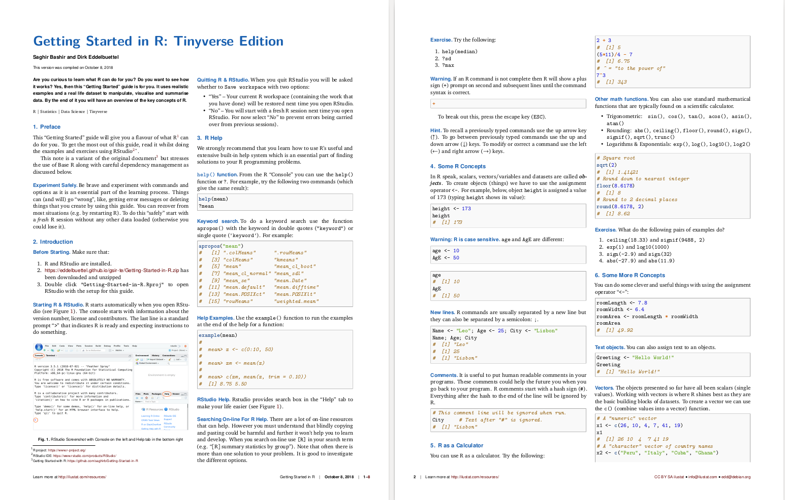

## Getting Started in R

An [eight-page pdf guide](https://eddelbuettel.github.io/gsir-te/Getting-Started-in-R.pdf) for "Getting Started in R".

### Objective

To create a short guide that gives a quick overview and introduction to R. 

### How?

* Using a practical approach of showing how to do things immediately using realistic 
examples and a real life dataset. 
* Avoiding technical details where possible.
* Making it fun and interesting.

### For whom?

* Beginners.
* Data scientists, statisticians, programmers, ... who want to get a flavour of R.
* Those who want a quick refresher guide to R.
* The curious.

### Outcome

* After reading the guide, following the examples and doing exercises you will 
learn how to manipulate, visualise and summarise data.
* Hopefully you will have the curiousity to learn more :)

### Try it now!

1. [Clone](https://help.github.com/articles/cloning-a-repository/) this repo,
   [download the pdf](https://eddelbuettel.github.io/gsir-te/Getting-Started-in-R.pdf), or
   [zip](https://eddelbuettel.github.io/gsir-te/Getting-Started-in-R.zip) files !
2. The repository and
   [zip](https://eddelbuettel.github.io/gsir-te/Getting-Started-in-R.zip)
   file contain an RStudio Project file.
3. Open the Project file, or [Getting-Started-in-R.pdf](Getting-Started-in-R.pdf). to get started.
4. Enjoy :)

### Origin

This is modified version of
[Getting-Started-in-R](https://github.com/saghirb/Getting-Started-in-R) by 
[Saghir Bashir](https://github.com/saghirb), with a careful focus on
dependency use which we refer to as [_The Tinyverse_](http://www.tinyverse.org/).

### Thanks

A big thank you to the [reviewers and contributors](Contributors.md).

### License

GPL-3

### Authors

Saghir Bashir and Dirk Eddelbuettel
